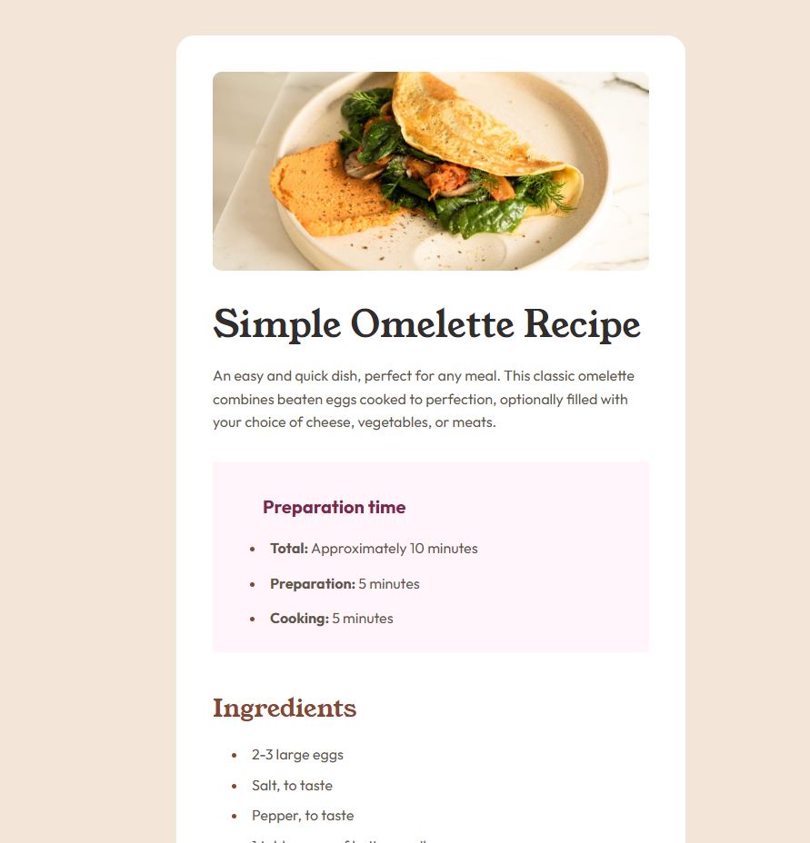

# Frontend Mentor - Recipe page solution

## Table of contents

- [Overview](#overview)
  - [The challenge](#the-challenge)
  - [Screenshot](#screenshot)
  - [Links](#links)
- [My process](#my-process)
  - [Built with](#built-with)
  - [What I learned](#what-i-learned)
  - [Continued development](#continued-development)
  - [Useful resources](#useful-resources)
- [Author](#author)

## Overview

This is a solution to the [Recipe page challenge](https://www.frontendmentor.io/challenges/recipe-page-KiTsR8QQKm) on Frontend Mentor.

 It's built using HTML and CSS, aiming for a pixel-perfect reproduction of the provided design and fullfiling goals given by platform.

### The Challenge 

The main goal of this challenge was to:

✔ **Practice semantic HTML:** Focus on selecting the most appropriate HTML elements for each piece of content to ensure accessibility and meaningful structure. 

✔ **Achieve pixel-perfect design:** Train attention to detail by matching the solution's appearance as closely as possible to the provided design previews.
  * *This aspect of the challenge was particularly demanding, requiring meticulous attention to detail and precise adjustments for layout and spacing.*

### Screenshot

<table>
  <tr> 
    <td align="center"><h4>Preview from challenge</h4></td>
    <td align="center"><h4>Solution screenshot</h4></td>
  </tr>
  <tr>
    <td align="center">  </td>
    <td align="center">  </td>
  </tr> 
</table>

## Links

* Solution URL: [GitHub Repo](https://github.com/dinruz/recipe-page)
* Live Site URL: [Watch Demo](https://dinruz.github.io/recipe-page)

## My process

* **Developed as part of:** The Frontend Mentor challenge
* **Creation Date:** 06-07-2025
* **Completion Date:** 11-07-2025
* **Status:** Complete

### Built with

* **HTML5**
* **CSS3**
  * Custom CSS properties - variables
  * flexbox
* Tools & Workflow: PerfectPixel, Visual Studio Code

### What I learned

**I learned:**

*  proper **identation**
  * `text-indent` - for first line indentation of `
` and `<li>`
  * `list-style-position: inside` - for indentation inside `<ol>` / `<ul>`
*  **multi-line list text alignment**: Learned to use `padding-left` and `text-indent` for list item text alignment
* **styling lists' markers**
  * use of **`li::marker` selector** with color and font-weight property 
* **table styling**
  * spacing between table columns using `padding-right` on `td:first-child` and `padding-left` on `td:last-child` 
  * full-width table borders** applying `border-bottom` to `<td>` elements while controlling width in percentages (%) for `td:first-child` and `td:last-child` with `border-collapse: collapse`
* **`
` not rendering** - correct by adding `width: 100%` (DevTools was revealed there was no width)

### Continued development

**Areas for Further Development:**

- **Responsive Design**
  - media queries
  - various responsive units (rem, em, vw, vh)
- **A11y**
  - ARIA attributes,keyboard navigation etc.
- **Advanced CSS Styling**:
  - more CSS techniques for pixel-perfect design
  - animations, transitions etc.

### Useful resources

* [MDN: **'::marker'**](https://developer.mozilla.org/en-US/docs/Web/CSS/::marker)

## Author

* Github profile: [dinruz](https://github.com/dinruz)
* Frontend Mentor profile: [dinruz](https://www.frontendmentor.io/profile/dinruz)
